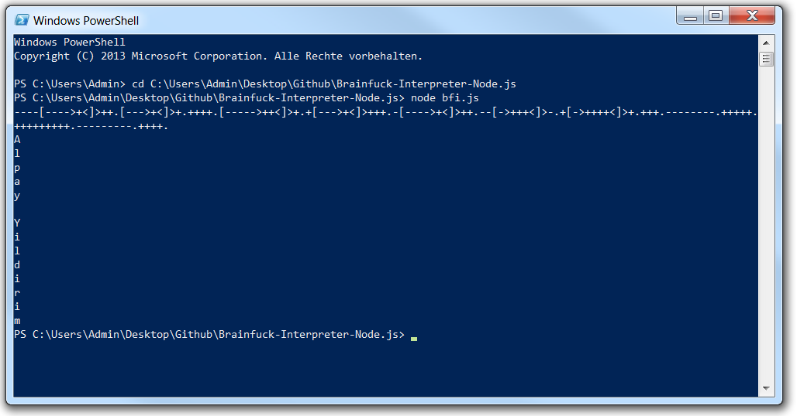
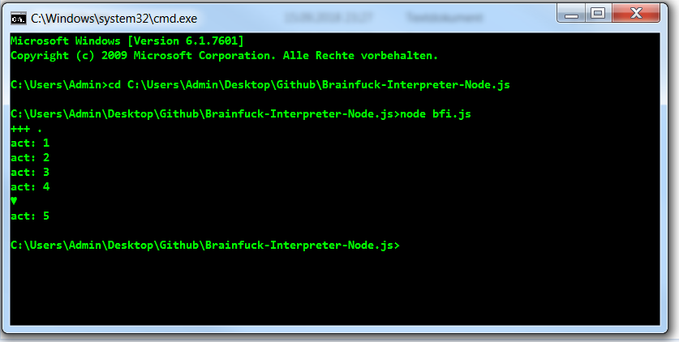

# 🛠 Brainfuck Interpreter Node.js 🖥

This is a **Brainfuck** Interpreter written in JavaScript (Node.js).  
**Brainfuck** is an **esoteric programming language** created in 1993 by Urban Müller, and notable for its extreme minimalism.

## 🖥 How to use it (Windows) 🖥 :

1. Start CMD or PowerShell
2. cd (bfi.js Filepath on your system) example: ***cd C:\Users\Admin\Desktop\Github\Brainfuck-Interpreter-Node.js***
3. ***node bfi.js***
4. Enter your **Brainfuck** Code[**, Or you can take One of my Samples**](https://github.com/AYIDouble/Brainfuck-Code-Samples)

## 🖼 Images 🖼
### PowerShell

### CMD

